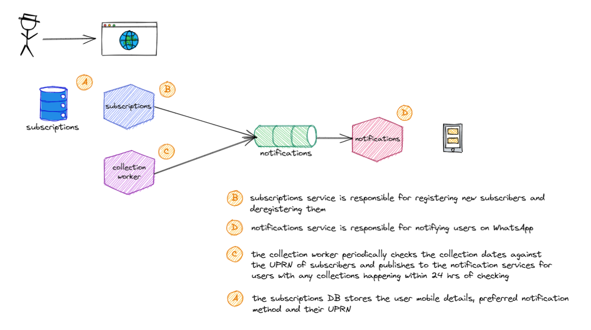

# binboi

A bin collection reminder for Reading council.

## Contributing

Binboi is a monorepo that stores its frontend and backend code in two separate directories:

* [frontboi](./frontboi/)
* [backboi](./backboi/)

The directories should be as self-contained as possible, such that it should be easy to pull them out into their own Github repos in the future. For the time being, it's just easier to maintain a monorepo at small scale than create two separate Github repos. If you want to contribute to either source code, please follow the README in each directory. Otherwise, docs are globally maintained in the [`docs`](./docs/) directory.

The recommended IDE to develop Binboi with is [VS Code](https://code.visualstudio.com/download), since there is a supplied devcontainer with this codebase. The same devcontainer is used for developing both the frontend and backend of Binboi.

## System Design

